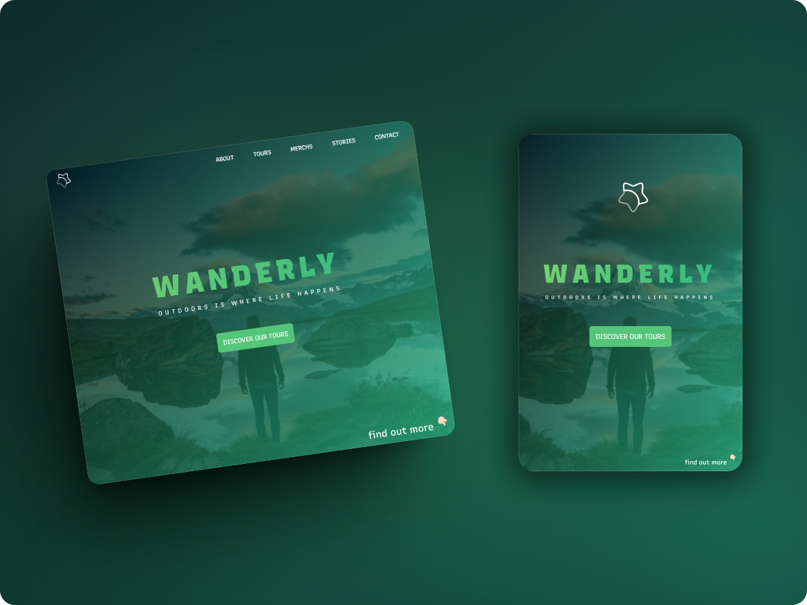

# Wanderly

A minimal Front-end implementation for a **fictional** travel agency. Inspired by [this](https://dribbble.com/shots/19521395-Natours) design.</a>

## Tech stack

- Vite
- React
- Vanilla JS
- SASS

## Mock data

- Text content: AI-Generated.
- Images: mostly taken from [Unsplash](https://unsplash.com/), including their random image API.

## Other resources

- [User stories & tasks](./user-stories.md)
- [Custom React hooks collection](https://nikgraf.github.io/react-hooks/)
- [CSS animations](https://animista.net)
  > Some of the animations presented in this project are taken from this website, but I've replaced them with my own implementation cause they felt a bit too heavy for the purpose of this project.
- [Random avatar API](https://pravatar.cc) (for testimonials section)
- [SVGs](https://www.svgrepo.com) (including the app's logo)
- [React Icons](https://github.com/react-icons/react-icons)
- [Typeface](https://www.recursive.design)
  - Recursive Sans Casual Static
  - Recursive Mono Casual Static
- Canva smart mockups
---

> [!NOTE]
> This project is for educational purposes only.
